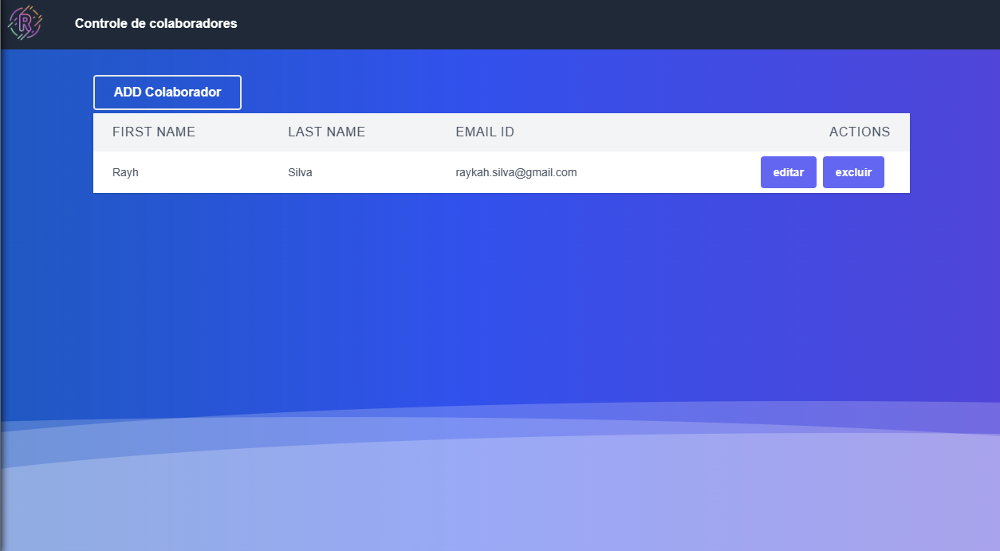
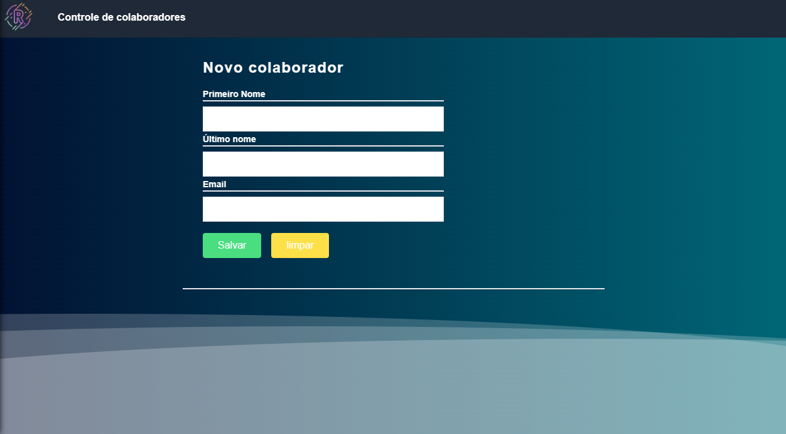
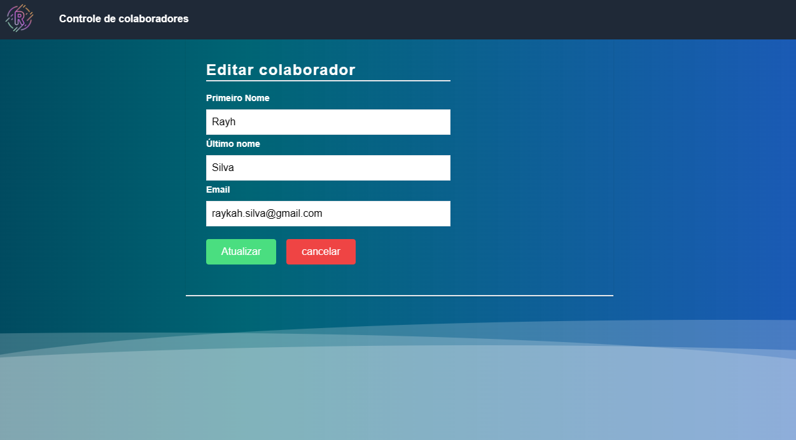

# Contole de colaboradores by ImRayh


## Visão geral:
Esse projeto é simples para o aprendizado do framework Next.js com uma API do ecossistema spring,
as funcionalides são de um CRUD (Create, Read , Update, Delete).

## Para executar o projeto:

Execute os comando a partir do se gerenciador de pacotes para instalar as depedências:

```bash
npm install
#ou
yarn
```

```bash
npm run dev
# or
yarn dev
```

## imagens



